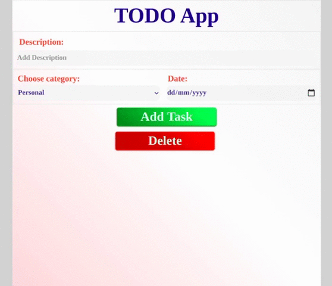

# TODO-App-CN

ToDo App is a task management app to help you stay organized and manage your day-to-day tasks.

# Preview



# Functionality

1. Add Todo
2. Delete Todo
3. Select n todo and delete all at once

# Instruction to run project

1. Clone this repository from https://github.com/dheerajk7/TODO-App-CN.git
2. Install Node, MongoDB, NPM etc if you have not installed yet.
3. Go to project directory and run these commands

   #### To install node Modules

   ```
   npm install
   ```

   #### To run project

   ```
   npm start
   ```

4. Go and check at http://localhost:8000

# Techstack

### Node JS, Mongo DB, EJS, HTML, SCSS
